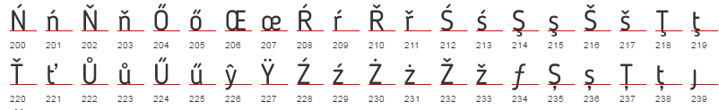

# Typr.js  

[LIVE DEMO](https://photopea.github.io/Typr.js) Typr.js is a Javascript parser and utility for working with fonts (TTF, OTF). It is an alternative to [opentype.js](https://github.com/nodebox/opentype.js). It is the main text engine for [Photopea image editor](https://www.photopea.com).

* light and small (70 kB unminified uncompressed, 4x smaller than opentype.js)
* ultra fast (2x to 5x faster parsing than opentype.js)
* successfully parsed more than 3000 fonts (opentype.js had problems with many of them)
* simple structure and easy to extend
* supports colored (SVG) fonts



Typr.js consists of static functions only, it can be easily rewritten into C or any other procedural language. There are no constructors, no methods, no complex structure. It consists of two independent parts (separate files):

* `Typr` - main parser, parses the raw data, generates the font object.
* `Typr.U` - Typr utilities. Basic operations with fonts. Use it as a guide to write your own utilities.


## Typr

#### `Typr.parse(buffer)`
* `buffer`: ArrayBuffer, binary data of the TTF or OTF font
* returns a font object

The output object has a structure, wich corresponds to the structure of the TTF/OTF file. I.e. it is a set of tables, each table has its own structure.

```javascript
var font = Typr.parse(buffer);
console.log(font);
```
## Typr.U

#### `Typr.U.codeToGlyph(font, code)`

* `font`: font object
* `code`: integer code of the character
* returns an integer index of the glyph, corresponding to the unicode character

#### `Typr.U.stringToGlyphs(font, str)`

* `font`: font object
* `str`: standard JS string
* returns an array of glyph indices for the string. Calls codeToGlyph() for each character code and performs mandatory glyph substitution (e.g. in Arabic, the same character may need different glyphs at th beginning, in the middle or at the end of a word). Also adds mandatory ligatures.

#### `Typr.U.getPairAdjustment(font, gid1, gid2)`

* `font`: font object
* `gid1`: index of the first glyph
* `gid2`: index of the second glyph
* returns the the adjustment parameters of the pair of glyphs

#### `Typr.U.glyphToPath(font, gid)`

* `font`: font object
* `gid`: index of the glyph, which you want to access
* returns the vector path of the outline of the glyph

Typr.js uses the following structure to represent the path:
```javascript
{ cmds: [CMD,CMD,CMD, ...], crds:[X,Y,X,Y, ...] }
```
`cmds` is an array of commands (Strings), `crds` is an array of coordinates (Numbers). Each command needs a specific number of coordinates. The path can be processed by passing both arrays from the left, index into `crds` depends on the types of previous commands.

* "M": (X,Y) - move the pointer to X,Y.
* "L": (X,Y) - line from the previous position to X,Y.
* "Q": (X1,Y1,X2,Y2) - quadratic bézier curve from the previous position to X2,Y2, using X1,Y1 as a control point.
* "C": (X1,Y1,X2,Y2,X3,Y3) - cubic bézier curve from the previous position to X3,Y3, using X1,Y1 and X2,Y2 as control points.
* "Z": () - draw a line to the first point to finish the outline.
* "#rrggbb" : () - set the current collor to RGB(rr,gg,bb) (SVG fonts use this)
* "X": () - fill the current path (SVG fonts use this)

A "raindrop" shape: `{ cmds:["M","L","Q","Z"], crds:[0,0,20,80,0,120,-20,80] }` (2 + 2 + 4 + 0 coordinates). 

The format is similar to SVG, but commands and coordinates are separated. It is comfortable to work with coordinates as a set of 2D points, apply affine transformations etc.

#### `Typr.U.glyphsToPath(font, gls)`

* `font`: font object
* `gls`: the array of glyphs, wich you want to draw using a font
* returns the vector path of the outline of the input glyph array

Note, that all paths returned by `Typr.U` are in font units ( font.head.unitsPerEm ). You must scale them down to convert them to pixels.

#### `Typr.U.pathToContext(path, ctx)`

* `path`: path to draw
* `ctx`: context2d to draw the path into

It executes each command of the path with a corresponding command of context2D: moveTo(), lineTo(), ... It does nothing else (you must do translate(), scale(), fillStyle, fill(), stroke() ... manually).

#### `Typr.U.pathToSVG(path)`

Converts a path to an "SVG path string", which can be used in `<path d="..." />`.

## Extending Typr

Let's implement a little function for drawing a string:
```javascript
Typr.U.stringToContext = function(font, str, ctx, size, color, x, y)
{
  var gls  = Typr.U.stringToGlyphs(font, str);
  //  gls.reverse();  // reverse if Right-to-Left
  var path = Typr.U.glyphsToPath  (font, gls);
  var scale = size / font.head.unitsPerEm;
  
  ctx.translate(x,y);  ctx.scale(scale,-scale);
  
  ctx.fillStyle = color;
  Typr.U.pathToContext(path, ctx);
  ctx.fill();
  
  ctx.scale(1/scale,-1/scale);  ctx.translate(-x,-y);
}
```

## Right-to-left text direction

There is a "view direction" (left to right) of glyphs, in which they are usually rendered. It may be different than the logical direction of characters in the memory (in which they are written). 

`Typr.U.stringToGlyphs` expects characters to be in the logical direction, while `Typr.U.glyphsToPath` method expects glyphs to be in the "view direction" (left to right).

If your text contains e.g. only Arabic / Hebrew parts, just reverse the array of glyphs before calling `Typr.U.glyphsToPath`. When your text contains both RTL and LTR parts, reorder glyphs according to the Unicode BIDI algorithm (e.g. using [unicode-bidirectional](https://github.com/bbc/unicode-bidirectional)).

